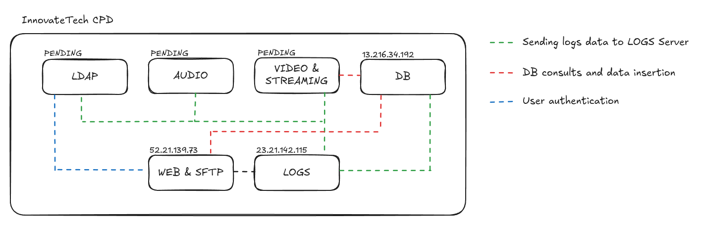

# InnovateTech CPD Servers Architecture

This document provides a comprehensive overview of the architecture, network configurations, and current deployment status of the InnovateTech Data Center (CPD) server infrastructure.

---

##  Architecture Overview

---

##  Infrastructure Summary

| Server Role | Hostname | Instance Type | IP Address | Storage | Status |
| :--- | :--- | :--- | :--- | :--- | :--- |
| **Web Server** | `InnovateTech-WebServer` | `t2.micro` | `52.21.139.73` | 20GB GP3 | 🟢 Active |
| **Database Server** | `InnovateTech-DB-Server` | `t3.small` | `13.216.34.192` | 20GB GP3 | 🟢 Active |
| **Logs Server** | `InnovateTech-Logs-Server` | `t3.large` | `23.21.142.115` | 20GB GP3 | 🟢 Active |
| **LDAP Server** | *PENDING* | `t3.small` | *PENDING* | 20GB GP3 | 🟡 Provisioning |
| **Audio Server** | *PENDING* | `t3.medium` | *PENDING* | 30GB GP3 | 🟡 Provisioning |
| **Video & Streaming** | *PENDING* | `t3.large` | *PENDING* | 50GB GP3 | 🟡 Provisioning |

---

## Detailed Server Specifications

###  Web Server
* **Hostname:** `InnovateTech-WebServer`
* **Instance Type:** `t2.micro`
* **IP Address:** `52.21.139.73`
* **Storage:** 20GB GP3

###  Database Server
* **Hostname:** `InnovateTech-DB-Server`
* **Instance Type:** `t3.small`
* **IP Address:** `13.216.34.192`
* **Storage:** 20GB GP3

###  Logs Server
* **Hostname:** `InnovateTech-Logs-Server`
* **Instance Type:** `t3.large`
* **IP Address:** `23.21.142.115`
* **Storage:** 20GB GP3

###  LDAP Server
* **Hostname:** `PENDING`
* **Instance Type:** `t3.small`
* **IP Address:** `PENDING`
* **Storage:** 20GB GP3

###  Audio Server
* **Hostname:** `PENDING`
* **Instance Type:** `t3.medium`
* **IP Address:** `PENDING`
* **Storage:** 30GB GP3

###  Video & Streaming Server
* **Hostname:** `PENDING`
* **Instance Type:** `t3.large`
* **IP Address:** `PENDING`
* **Storage:** 50GB GP3
